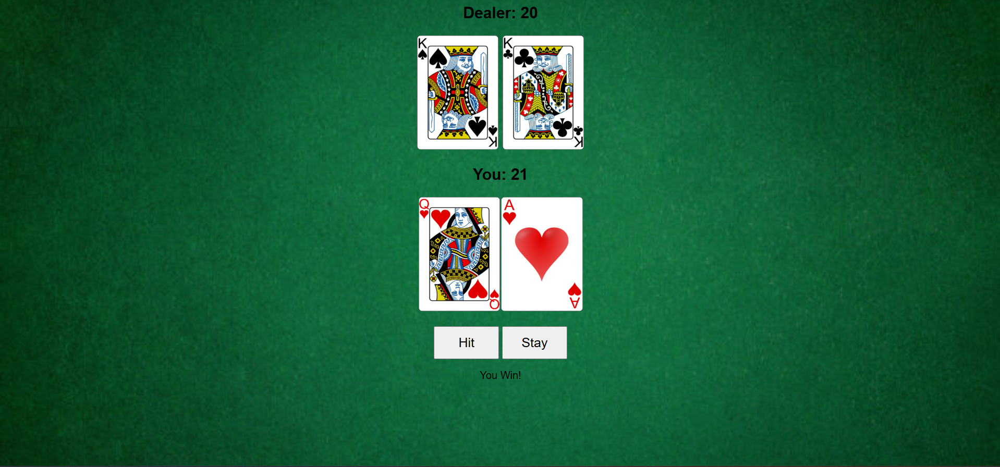

# Blackjack Game
This is a classic Blackjack game built with HTML, CSS, and JavaScript. It's a simple, interactive game where the player can play against the dealer to get a hand as close to 21 as possible without going over.

## Features
-   **Interactive Gameplay:** Click "Hit" to draw another card or "Stay" to end your turn.
-   **Score Tracking:** The game automatically calculates and displays the scores for both the player and the dealer.
-   **Ace Logic:** Correctly handles the value of Aces (1 or 11) to prevent the player from busting.
-   **Clean UI:** A simple and intuitive user interface with a casino-themed background.

## How to Play
1.  Clone this repository to your local machine.
2.  Open the `index.html` file in your web browser.
3.  Click the "Hit" button to take another card, or "Stay" to let the dealer play.
4.  The game will announce the winner based on the final scores.

## Screenshot

## Technologies Used
-   **HTML:** For the game's structure.
-   **CSS:** For styling and layout.
-   **JavaScript:** For the game's core logic.
